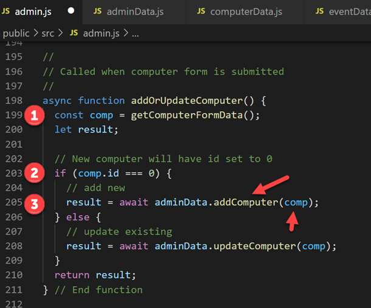

# Web Client App part 3 - Admin features

##### Enda Lee 2022

#### Quick Start

in terminal: 

1. ```npm install```
2. set `supabaseUrl` and `supabaseKey` in `/public/src/dataAccess/supabase.js`
2. ```npm run start```
2. open http://localhost:3000/admin.html

## Introduction

This tutorial continues from part 2 and adds some administrative features, including:

1. **`Delete events`** from the database.
2. **`Add`**, **`update`**, or **`delete`** computers from the database.

New pages and scripts have been added to support the new functionality. **`admin.html`** and **`admin.js`** are new versions of `indes.html` and `index.js` designed for **site administration** and not for end user access. 

A new data access script **`adminData.js`** contains the functions used to `insert` `update` and `delete`.


Open the start project  in  **[VS Code](https://code.visualstudio.com/)**, run the web server, and view **http://localhost:3000/admin.html** before continuing this tutorial.

The admin page looks similar to the the default `index.html` view with additional buttons to add, edit, or delete. The following sections will explain how everything works.


## Part 1: Add a new Computer

The Add computer form is hidden by default and only displayed when the **Add Computer** or an **Edit** button is clicked. When displayed it acquires *focus* and the page is greyed out in the background.

### 1. Show the form when the Add Product button is clicked

The `add form button` has been added under the product table. It has been configured to `toggle` (show/ hide) the a **Bootstrap modal form** When clicked, the form is displayed, appearing as a dialog in focus and in the foreground.

For more about modal dialogs see https://getbootstrap.com/docs/5.0/components/modal/

##### The modal form:


##### The Modal dialog and form in `admin.html`

See **`admin.html`** for the HTML + Bootstrap styling used to create the form and make it `modal`. 

The Bootstrap 5 modal dialog defines a `header`, `body`, and `footer` sections. The `computer form` is defined in the `body` section. Other than being defined in the modal, it is a standard form with Bootstrap styling. Note the form `input` elements for each of the `computer attributes` . The form button are defined in the modal footer.

The `id` attribute value of the modal `div element`, `computerFormDialog` will be used elsewhere to show or hide the modal.


### 2. The Add Computer Button

The `Add computer` button uses Bootstrap to show or hide the `modal form`. `data-bs-target` defines  the modal element `id` to display when clicked.


Additional code can also be be executed by attaching an `event listener` to the button - near the end of **`admin.js`**:

When the `Add computer` button is clicked the `computerFormSetup()` function is called to set the form title and reset the fields.


##### The `computerFormSetup()` function

the value for `formTitle` is set to `Add a new Computer` by default, in case the parameter is not provided.


### 3. Submitting the form

When the form is submitted (by clicking the `save` button), the  `addOrUpdateComputer()` function is called to process the data entered.

1. This function first calls the **`getComputerFormData()`** function to get a copy of the values entered in the form. 
2. If the `id` value is 0, that indicates a new computer - as existing computers will have a `id` value set.
3. Call `adminData.addComputer()` passing the new computer data. 




##### The **`getComputerFormData()`** function:

The function reads each form field and returns them as an object.

The result is a computer object with `id`, `name`, `description`,  and  `location`.


##### `adminData.addComputer()`

**`adminData.js`** is imported at the top of `admin.js`makings its functions available via `adminData.`


The `addComputer()` function uses `Supabase` to insert the computer by setting up the API call, and setting the data in an `insert` statement. 


## Part 2: Edit an existing computer

Editing or updating an existing computer builds on the previous step. The same form and functions will  will be used where possible.

### 1. Selecting the computer to edit

This is where updating a computer differs from adding a computer. Instead of starting with an empty form, it must start with the existing values. 

Each computer in the admin page has an `edit` button next to it. This button is used to choose which computer to edit (see the `displayComputers()` function in `index.js`).


The buttons also have click events associated with them, defined at the end of `displayComputers()`:

1. Get a reference to each set of buttons, using a `css class` associated with each.
2. Add click event listeners for **filtering by computer**.
3. Add click event listeners for **deleting a computer**.
4. Add click event listeners for **updating a computer**.


##### The `prepareUpdate()` function is called when an edit button is clicked
This function retrieves a computer by its `id` and fills the form for editing:

1. Use the `data-computer_id` value of the button clicked to `getComputerById()`. This function can be found in `computerData.js`.
2. If a computer was returned, initialise the form - same as for add computer but with a different title.
3. Fill out the form inputs with the computer values, including `id`.


### 2. Updating the computer

When the form `save` button is clicked, the `addOrUpdateComputer()` function is called. This time when it checks for `id === 0` the result will be `false` as the computer will have an existing `id` (set in the **hidden** `id` field). That will result in `adminData.updateComputer()` being called.


##### `adminData.updateComputer()` uses a Supabase update call:


## Part 3: Deleting a computer

As shown above, each computer has a **delete** button associated with it (in addition to the edit button).

When clicked, the button calls the **`deleteComputer()`** function in **`admin.js`**


1. First a JavaScript `confirm` dialog is displayed to verify the delete.
2. Then `adminData.deleteComputer()` is called to perform the delete.


##### `deleteComputer()` in `admindata.js`

1. Before a computer is deleted, its associated events must be deleted first so as not to break referential integrity in the database (there is a one-to-many relationship between computers and events).
2. Call `deleteComputerEvents()` which deletes from events where computer = id
3. Finally delete the computer.


## Part 4: Delete an Event

Each event has a delete button. When clicked, the `deleteEvent()` function is called. It confirms the delete should go ahead and then calls the `deleteEventById()` function in `adminData.js`


## Part 5: Subscribing to database changes

You may notice that the web page doesn't update or needs to be refreshed before changes are displayed whenever data is added or deleted.

Supbase provides a solution to this problem by providing a way to receive change notifications in the page.

The data `subscription` code is already included at he end of both `index.js` and `admin.js`


#### Before this works, it must be enabled in the database settings.

Open your database in http://supabase.io 

1. Click the database icon
2. Choose Replication
3. Enable `supabase_realtime` updates for all of the options.


4. Choose the tables which will be be monitored for changes.


5. That's it, changes should take effect after reloading the website.


------

Enda Lee 2022
